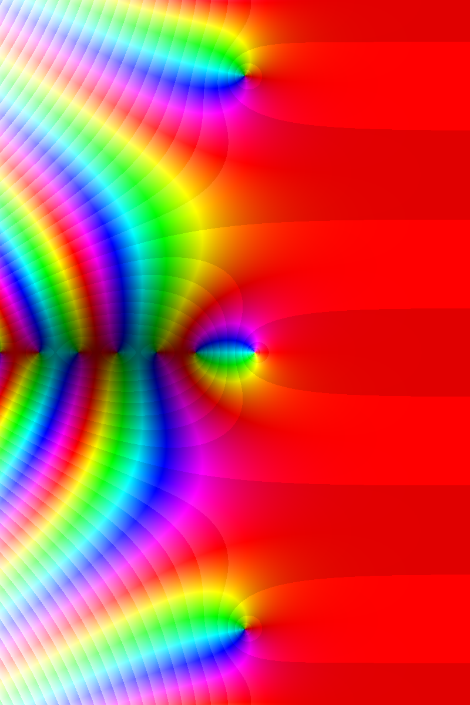
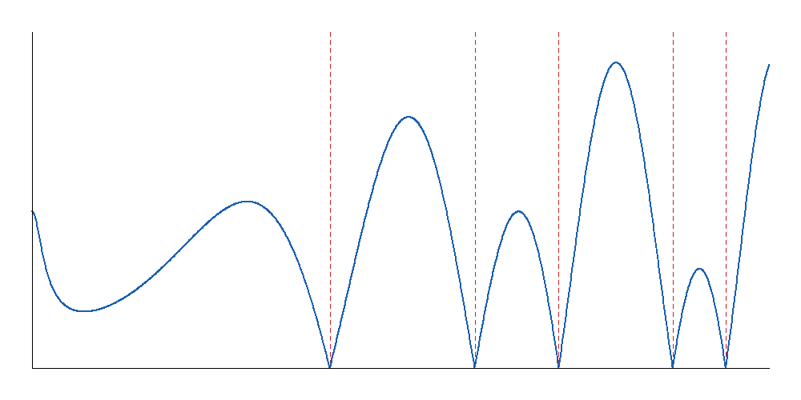

# RiemannLab

[](https://github.com/SaumayAshish/riemann-lab/actions/workflows/ci.yml)

A Java platform for numerically evaluating the Riemann zeta function and investigating its non-trivial zeros — critical-line scanning, zero refinement, visualization, cross-checked precision validation, and performance benchmarking, built from first principles on the JVM.

> **This project does not prove or claim anything about the Riemann Hypothesis.** Every zero it finds is located numerically, to a stated, checked error bound. Numerical evidence for a finite range of zeros is not a proof for all zeros, and this codebase never claims otherwise.

## What it does

- **Evaluates ζ(s) for complex s**, including across the critical strip, via multiple independent strategies (a naive Dirichlet-eta series, an accelerated eta series using Euler transformation, and analytic continuation via the functional equation) — cross-checked against each other rather than trusted blindly.
- **Scans the critical line** Re(s) = 1/2 for local minima of |ζ(s)|, the numerical signature of a nearby zero, both sequentially and in parallel, with a proven-identical-output correctness guarantee between the two paths.
- **Refines candidates to machine precision** using complex-valued Newton-Raphson and secant root finders.
- **Validates itself**: known-zero catalog cross-checks, error-bound honesty checks (does the claimed precision match the actual residual?), and eta-series-vs-functional-equation agreement checks — three independent validation passes, not one.
- **Visualizes** ζ(s) via domain colouring across the complex plane and plots |ζ(s)| along the critical line, backed by the same live evaluation and zero-finding pipeline used everywhere else (not a separate, unverified rendering path).
- **Benchmarks itself** with JMH — every performance claim in this project's history is backed by a measured before/after, never an assumption.
- **Is observable**: structured logging (SLF4J/Logback, MDC-tagged by scan mode) and Micrometer metrics (evaluation counts, scan duration, minima found/discarded), with a reader that turns the metrics back into a human-readable summary.

## Architecture

com.riemannlab
├── core.complex Complex value type (record) and complex-valued exp/log/pow
├── core.numeric Series acceleration, Newton-Raphson and secant root finders
├── core.special Complex gamma function (Lanczos approximation)
├── zeta ZetaEvaluator strategies: naive, accelerated eta, continued (functional equation)
├── zeros Critical-line scanning, candidate refinement, scan metrics
├── analysis Theoretical zero-density and spacing tables (independent of the live scanner)
├── validation Cross-checks against known zeros/values, precision and agreement reports
├── viz Domain-colouring and critical-line plot rendering
├── app.cli Runnable demos exercising each stage of the pipeline
└── bench JMH benchmarks for evaluator and scanner throughput


The design separates **detection** (cheap, approximate, must not miss anything) from **refinement** (expensive, precise, only runs on plausible candidates) — see the JavaDoc on `CriticalLineScanner` and `ZeroRefiner` for the reasoning.

## Getting started

Requires JDK 25 and Maven.

```bash
git clone https://github.com/SaumayAshish/riemann-lab.git
cd riemann-lab
mvn clean verify
```

This compiles the project and runs the full test suite (currently 466 tests, all passing — see the CI badge above for the live status on `main`).

### Running a demo

Each class under `app.cli` has a runnable `main` method exercising one part of the pipeline — for example:

```bash
mvn dependency:copy-dependencies
java -cp "target/classes;target/lib/*" com.riemannlab.app.cli.CriticalLinePlotDemo
```

(On macOS/Linux, use `:` instead of `;` as the classpath separator.)

Available demos: `AccelerationDemo`, `ContinuationDemo`, `ConvergenceDemo`, `CriticalLineDemo`, `CriticalLinePlotDemo`, `RootFindingDemo`, `ValidationRunner`, `ZeroFinderDemo`, `ZeroScanDemo`, `ZeroSpacingDemo`.

### Running benchmarks

```bash
java -cp "target/classes;target/lib/*" com.riemannlab.bench.BenchmarkRunner <BenchmarkClassName>
```

Available benchmarks: `EvaluatorThroughputBenchmark`, `ScanThroughputBenchmark`.

## Sample output

<p align="center">
  
  
</p>

## Stack

Java 25, Maven, JUnit 5, SLF4J + Logback, Micrometer. No Spring Boot — this project deliberately stays close to plain Java throughout.

## Status

All 8 planned phases through observability are complete: core math, zero-finding, refinement, visualization, validation, performance benchmarking, and observability. GitHub polish (CI, this README, license) is in progress; project-wide documentation is next.